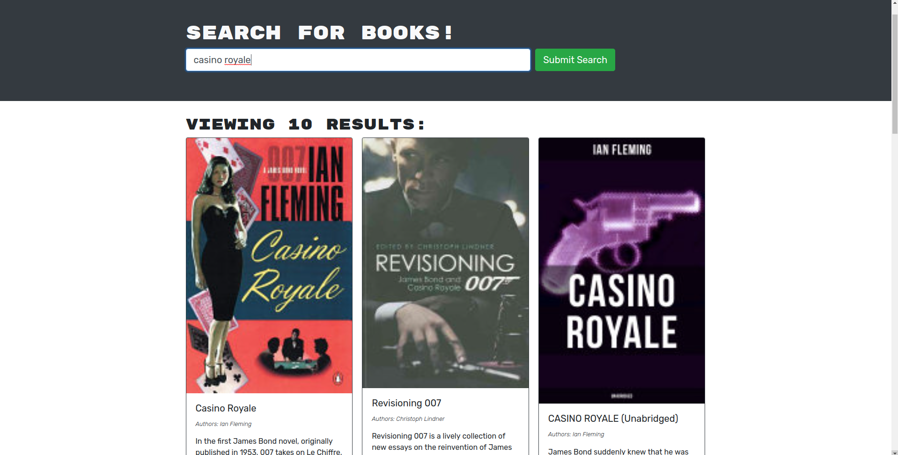
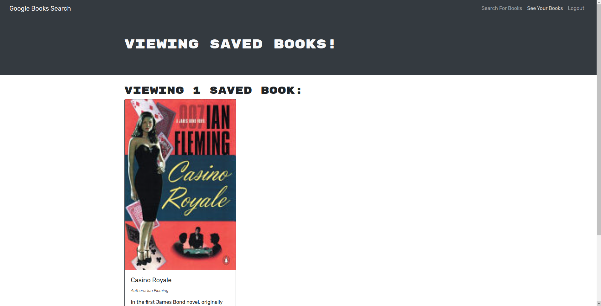

# Book Search Engine

This is a Google Books API search engine built with a GraphQL API on an Apollo Server. 

The purpose of this project was to take a fully functioning book search engine that was built with a RESTful API and refactor it to use a GraphQL API.

## Screenshots
*
*
*

## Built With
* JavaScript
* React
* MongoDB
* JWT
* GraphQL
* Apollo Server

## Website
* [Book Search Engine on Heroku](https://sleepy-woodland-19590.herokuapp.com/)

## (Recently Learned) Skills I Used
* creating an Apollo Server and applying it to an Express.js server as middleware
* modifying existing authentication middleware to work in the context of a GraphQL API
* creating an Apollo Provider so that requests can communicate with an Apollo server
* building API endpoints with GraphQL in a MERN application
* using GraphQL queries and mutations to fetch and modify server-side data
* configuring and deploying a MERN application to Heroku
