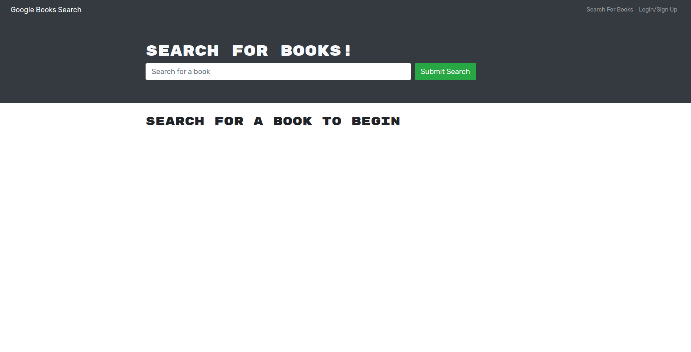

# Book Search Engine

This is a Google Books API search engine built with a GraphQL API on an Apollo Server. 

The purpose of this project was to take a fully functioning book search engine that was built with a RESTful API and refactor it to use a GraphQL API.

## Screenshots

## Built With
* JavaScript
* React
* NoSQL/MongoDB
* Mongoose
* JWT
* GraphQL
* Apollo Server

## Website
* https://book-search-engine.up.railway.app/

## (Recently Learned) Skills I Used
* Creating an Apollo Server and applying it to an Express.js server as middleware
* Modifying existing authentication middleware to work in the context of a GraphQL API
* Creating an Apollo Provider so that requests can communicate with an Apollo server
* Building API endpoints with GraphQL in a MERN application
* Using GraphQL queries and mutations to fetch and modify server-side data
* Configuring and deploying a MERN application to Heroku (and, later, Railway)
